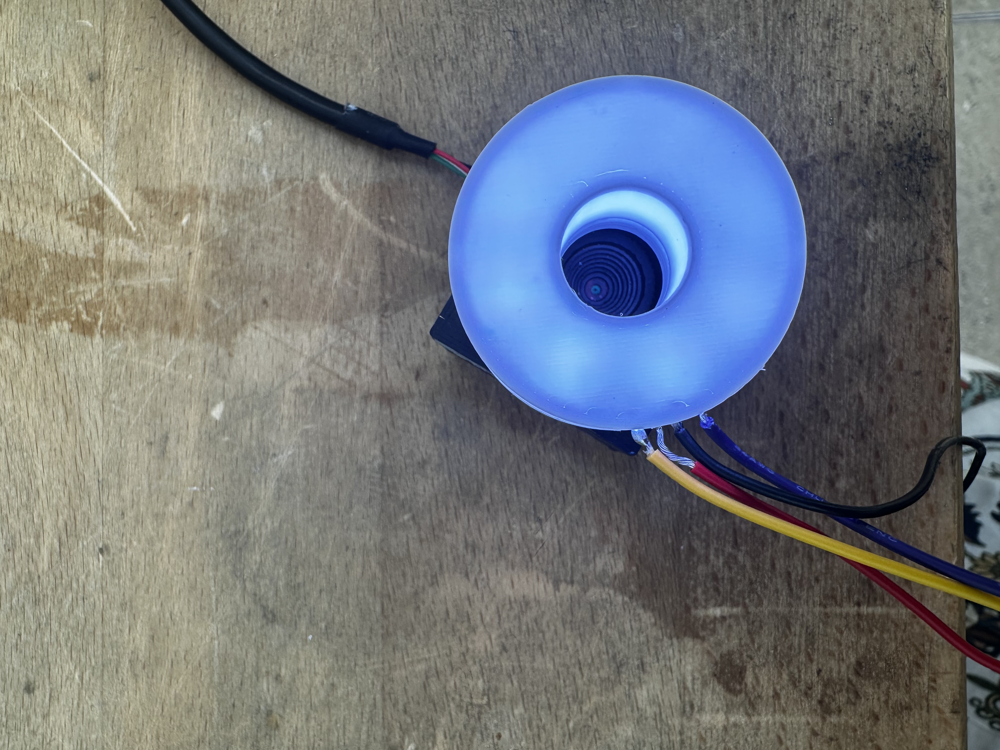
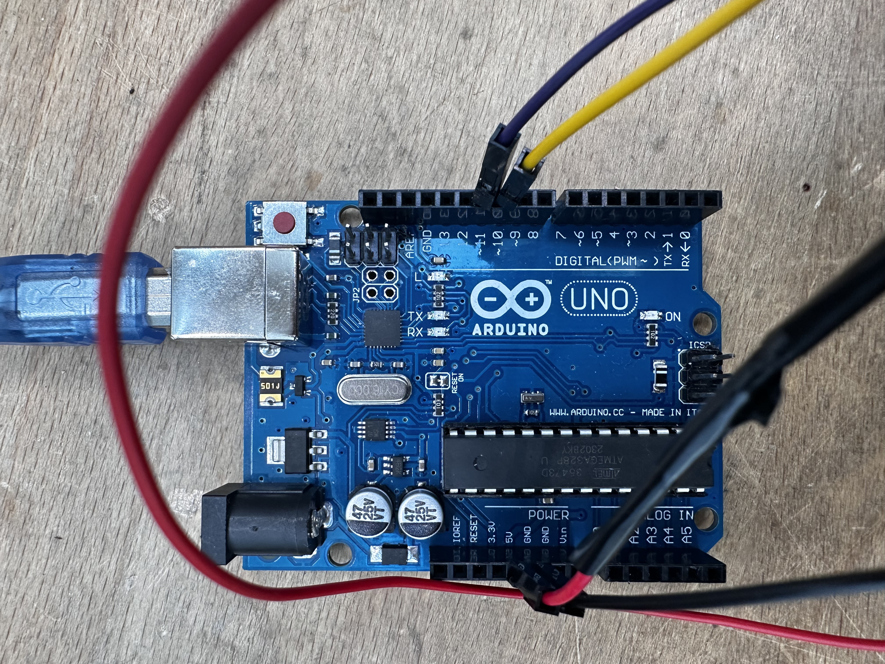
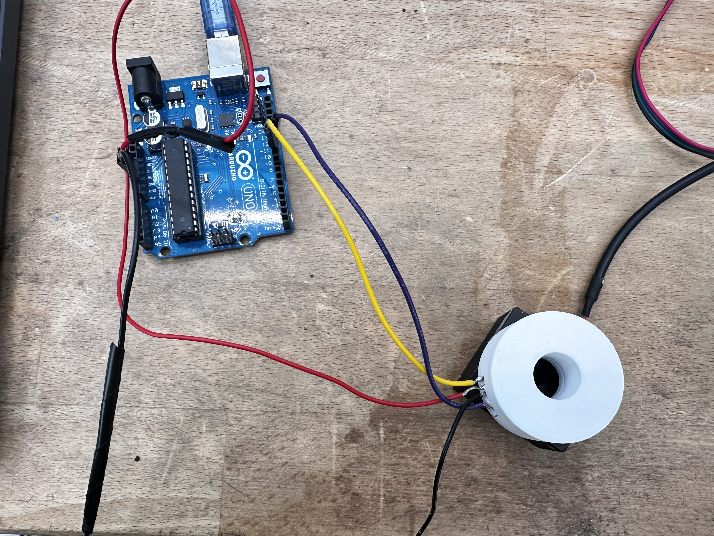
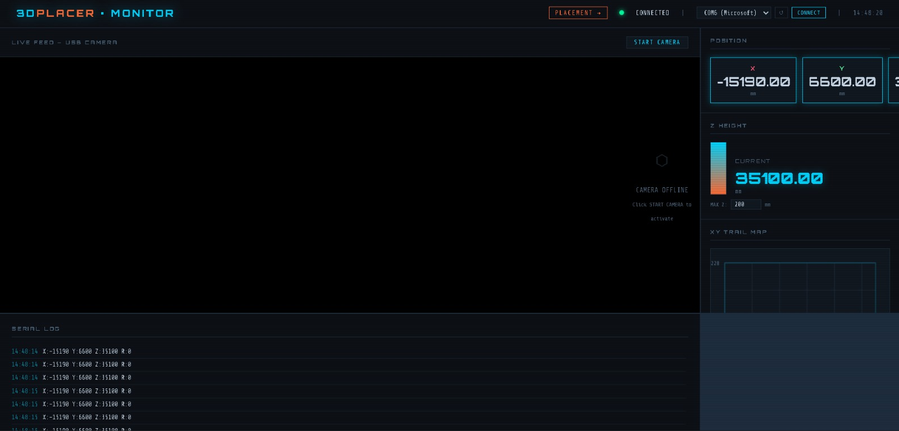
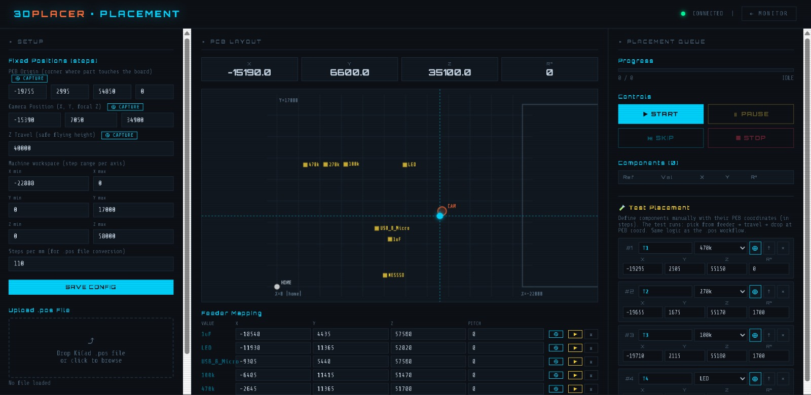
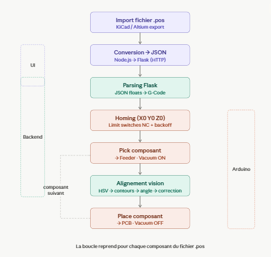

# 🤖 SMarDuino : Pick and Place Machine

<p align="center">
  
  
  
</p>

---

## 👥 Authors
*   [**Alae Messaoudi**](https://github.com/alaemessaoudi)
*   [**Khalil Romdhane**](https://github.com/khalilromdhane)
*   [**Yahya Boussaadia**](https://github.com/yahyaboussaadia)
*   [**Yosr Hallab**](https://github.com/yosrhallab)
*   [**Zeineb Sellami**](https://github.com/zeinebsellami) 

---

## 📌 Table of Contents
1.  [About The Project](#-about-the-project)
2.  [Final Result](#-final-result)
3.  [Built With](#-built-with)
4.  [Prerequisites & BOM](#-prerequisites--bom)
5.  [Hardware Architecture](#-hardware-architecture)
6.  [Electronics & Power](#-electronics--power)
7.  [Software Layers](#-software-layers)
8.  [Key Challenges & Solutions](#-key-challenges--solutions)
9.  [Milestones](#-milestones)
10. [License](#-license)

---

## 📖 About The Project

### Motivation
Assembling electronic boards manually is a slow and error-prone task. Professional **Pick and Place** machines are often expensive or limited in the thickness of components they can handle.

**SMarDuino** transforms a standard **Prusa i3 MK3S+ 3D printer** into a high-precision automated assembly station. By repurposing the printer's rigid frame and precise motion system, we create a machine capable of:
*   Picking ultra-small SMD components.
*   Correcting orientation via a **Bottom Camera (OpenCV)**.
*   Placing them accurately on a PCB using a vacuum-controlled nozzle.

> *"With SMarDuino, we solve the thickness limitation of industrial machines while keeping the project open-source and affordable."*

( [Back to top](#-table-of-contents) )

---

## 🚀 Final Result
At the end of this semester, SMarDuino functions as an autonomous Cartesian.

### 🎥 Demo
(//we need to add the video of the demo when it is done )

*Watch our full demo video here: [Project Video Link]*

### 📸 Reference Photos
(add photo references)

( [Back to top](#-table-of-contents) )

---

## 🛠 Built With
*    **Frontend** (Dashboard)
*    **Backend** (Flask & OpenCV)
*    **Firmware** (C++/G-Code)
*    **Hardware** (MK3S+ Frame)

---

## 📦 Prerequisites
Comprehensive list of elements we used in our project along with needed equipment. To construct the device, one should

**buy:**
*   **Arduino Mega 2560** Board
*   **cnc** Shield
*   5 Stepper motors **17HS4401** + **A4988 Drivers**
*   **Air pump RF370**
*   Air pump tubes (interior diameter 2.5mm and 4mm)
*   **USB bottom camera**
*   **USB isolator**
*   Power supply **12V 10A**
*   2m **Purecrea GT2 belt** (6mm)
*   DC Jack
*   One buck convertor
*   M3 and M4 Screws and nuts
*   Lightening rings

**have access to:**
*   **Prusa i3 MK3S+** 3D printer (to be modified)
*   3D printer with **PETG filament** (for custom parts)
*   Laser cutting machine
*   **MDF board** (for the base plate)
*   Soldering kit
*   Bunch of different screwdrivers
*   Driller

( [Back to top](#-table-of-contents) )

---

## 🏗 Hardware Architecture


#### 1. Mechanical Conversion
We replaced the standard Prusa extruder with a custom-engineered **X-Carriage** designed specifically for Pick and Place operations. This modular head integrates both the component handling and the feeding trigger.

*   **Vacuum Grabber Mechanism**: 
    *   Features a high-precision **vacuum nozzle** mounted on a spring-loaded Z-axis.
    *   Integrated with a **Y-junction pneumatic circuit** to allow for both picking and release.

#### 2. Passive Tape Feeding System
Inspired by the **LumenPnP** open-source community, our feeding system is **fully mechanical and passive**, significantly reducing the machine's weight and electronic footprint.

*   **Nozzle-Driven Advance**: 
    *   The head moves to the feeder, and the vacuum nozzle descends into the tape's **sprocket holes**.
    *   The machine performs a precise linear move to pull the tape forward, eliminating the need for individual stepper motors or servos for each feeder.
*   **Automatic Synchronized Peeling**: 
    *   This linear pull drives a series of **3D-printed internal gears**.
    *   The gears are calibrated with a specific ratio to peel back the protective film automatically as the tape advances, ensuring the components are always exposed at the exact pick-up location.
*   **Design Efficiency**: 
    *   **Scalable**: New feeders can be added to the base plate without needing additional motor drivers or wiring.

---

## ⚡ Electronics & Power
To avoid electrical noise, we implemented a **Dual Power Supply** system:
1.  **PSU A (12V/10A)**: Dedicated to the 5 high-current stepper motors.
2.  **BUCK Convertor** : from 12V to 5V for the pump


## Electronics Assembly

The final electronic architecture of the project has been assembled.

- Arduino Mega connected to the CNC Shield
- Five stepper motor drivers installed and configured
- X, Y, Z and rotation motors connected
- Limit switches added for homing
- Vacuum pump controlled using a transistor switching circuit
- The transistor allows the Arduino to safely activate and deactivate the pump
- Buck converter used to provide a stable power supply for the pump
- Camera system connected for component alignment
- Common ground shared between all electronic modules

This setup allows the machine to perform the full pick-and-place workflow:
homing, component pickup, camera alignment, and PCB placement.
**Circuit Schematic:**

(

###  Electronics Assembly of the CV

To support the Computer Vision module, a custom illumination system was developed. This ensures consistent lighting conditions for the HSV extraction algorithm.

#### 1. Hardware Components
* **Microcontroller**: Arduino Uno Rev3.
* **Light Source**: LED Ring (controlled via Digital Pins).
* **Housing**: Custom 3D-printed diffuser designed to eliminate reflections on metallic SMD components.

#### 2. Wiring Diagram
Based on the implementation, the connections are as follows:

| Ring Light Wire | Arduino Pin | Function |
| :--- | :--- | :--- |
| **Red** | **5V** | Power Supply (Stable 5V for LED consistency) |
| **Black** | **GND** | Ground |
| **Purple** | **D10** | Signal / Control Pin A |
| **Yellow** | **D11** | Signal / Control Pin B |

> [!IMPORTANT]
> Always use the **5V** pin instead of *Vin* when powering from USB to ensure the LED ring receives a regulated voltage, which is critical for maintaining stable brightness during image processing.

#### 3. Visual Setup

  
  
  


( [Back to top](#-table-of-contents) )

---

## 💻 Software Layers
SMarDuino runs on a three-tier software architecture:

*   **Layer 1 (Firmware)**: Custom G-Code interpreter on Arduino Mega to handle XYZ movements and vacuum solenoid.
*   **Layer 2 (Vision)**: Python script using **OpenCV** to detect component contours, extract rotation angles, and send correction commands.
*   **Layer 3 (UI)**: A web dashboard to upload PCB design files (CSV) and monitor the placement progress in real-time.
*   
  


---
## 💻 Software Architecture

### 🎨 Frontend & User Interface
The interface is a **Node.js WebApp** that serves as the machine's control center.

*   **Role**: It acts as a visual serial monitor and control station. It allows the user to upload `.pos` files (exported from KiCad/Altium) which contain the coordinates and rotations of all components.
*   **Tech Stack**: React, JavaScript, Tailwind CSS.

####  Dashboard Overview
Below are the two main views of the **3DPlacer Monitor** interface:

| **1. Monitor View (Real-time tracking)** | **2. Placement View (Setup & Queue)** |
| :--- | :--- |
|  |  |
| *Features: Live camera feed, absolute coordinate display, and raw serial communication logs.* | *Features: Interactive PCB layout map, feeder coordinate mapping, and placement sequence control.* |

---

### ⚙️ Backend & Motion Control 
The backend is powered by a **Flask server** (Python)...

### ⚙️ Backend & Motion Control 
The backend is powered by a **Flask server** (Python) that orchestrates the automation workflow.

**The Command Pipeline:**
1.  **Parsing**: Transforms JSON coordinates into Python floats.
2.  **G-Code Generation**: Converts coordinates into standardized serial commands (e.g., `M X22 Y33 Z44`).
3.  **Serial Communication**: Streams these commands via the COM port to the Arduino Mega.

**Motion Logic:**
*   **Homing Procedure**: Uses NC (Normally Closed) limit switches with a specialized **backoff movement** to ensure high-precision reference positioning (X0, Y0, Z0).
*   **Automated Sequence**: 
    `Homing` ➡️ `Move to Feeder` ➡️ `Pick (Vacuum ON)` ➡️ `Move to Camera (Alignment)` ➡️ `Place (Vacuum OFF)` ➡️ `Return to Home`.

    

### 👁️ Computer Vision
The CV module is the "brain" that ensures placement accuracy by detecting offsets in real-time.


👉 **[See all the detailed documentation of the CV](./computer_vision/README.md)**


*   **Detection Logic**: Initially based on color, the system was upgraded to a Brightness/Contrast-based detection (HSV Value channel extraction) to handle metallic and black SMD components regardless of ambient light.
*   **Pre-processing**: Noise elimination and pad filtering using a circularity threshold (< 0.8) to stabilize classification.
*   **Advanced Lighting**: Integration of a **[Custom Ring Light](#electronics-assembly)** + Diffuser (3D printed) to remove light "blobs" and ensure homogeneous diffusion. 
    > *See the [Wiring & Electronics section](#electronics-assembly) for the hardware implementation.*
*   **Feature Extraction**:
    *   Isolates metallic leads from dark backgrounds/nozzles.
    *   Detects component center coordinates and precise rotation angles.
    *   Converts visual pixel errors into motor steps for real-time correction.
*   **Supported Classification**: Resistors, Capacitors, LEDs, and Timers.
*   ## 🚀 Getting Started (Software)

### 1️⃣ Prerequisites
*   **Node.js** (v18+)
*   **Python** (3.10+)
*   **Arduino IDE**

### 2️⃣ Clone & Setup


### 1. Clone the Project
```bash
git clone https://github.com/epfl-cs358/2026sp-SMarDuino.git
cd 2026sp-SMarDuino
```

### 2. Frontend (Node.js)
```bash
cd 3d-placer-monitor
npm install
node server.js
```
It will be available at  http://localhost:3000

### 3. Backend (Flask + OpenCV)
Windows :
```bash
cd computer_vision
python -m venv venv
venv\Scripts\activate
pip install flask opencv-python pyserial numpy
python run_placement.py
```
Linux/Mac :
```bash
cd computer_vision
python3 -m venv venv
source venv/bin/activate
pip install flask opencv-python pyserial numpy
python3 run_placement.py
```
The flask server runs on: http://localhost:5000

### 4. Firmware Arduino

Launch the **Arduino IDE**

Go to File > Open and load 3d-placer-monitor/placer_4axis/placer_4axis.ino

In **Tools** > **Board**, Select **Arduino Mega 2560**

In **Tools** > **Port**, select the COM port of the board (ex: COM3)

Click **Upload** 


### 5. Configuration
In the 3d-placer-monitor/config.json, put on these parameters :
```bash
pythonSERIAL_PORT = "COM3"        # Windows : COM3 / Linux : /dev/ttyUSB0
BAUD_RATE   = 115200
CAMERA_ID   = 0             # Index of the USB camera (0, 1, 2...)
STEPS_PER_MM_X = 80
STEPS_PER_MM_Y = 80
STEPS_PER_MM_Z = 400
```

6. Start the session
Make sure that :

✅ Arduino is flashed and connected via USB

✅ Backend Flask is running

✅ Frontend Next.js running

Run http://localhost:3000
Import **.pos** file exported from KiCad/Altium
Click on **Start** — the machine will do the homing and start the placement of the components

---

### 🔄 Software & CV Integration Bridge

The integration between the **Flask Backend** and the **OpenCV Module** works through a closed-loop feedback system:
//See with Khlil about the integration and add this part 

**Workflow Diagram:**
`Backend Logic` ⮕ `CV Analysis` ⮕ `Coordinate Correction` ⮕ `Arduino G-Code'

---
## ⚠️ Key Challenges & Solutions

| Problem | Solution |
| :--- | :--- |
| **Sticky Components** | Implemented a **Y-junction pneumatic circuit** with a "Blow-off" pulse to cleanly release parts. |
| **Tube Twisting** | Integrated **Sealing Bearings** and software rotation limits (-90° to +90°). |
| **Precision** | Leveraged the MK3S+ micro-stepping capabilities for high repeatability. |
---


## 📅 Milestones
*   [x] **Milestone 1**: Mechanical conversion and basic XYZ motion control.
*   [x] **Milestone 2**: Integration of the feeding system and OpenCV vision module.
*   [ ] **Milestone 3**: Final reliability testing and full autonomous PCB assembly.

---


