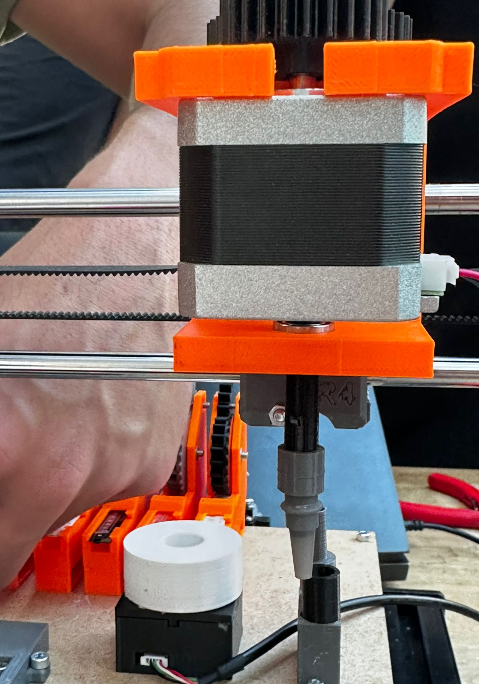
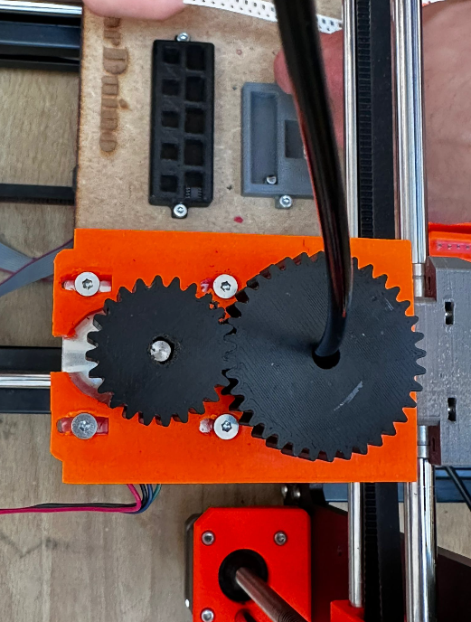
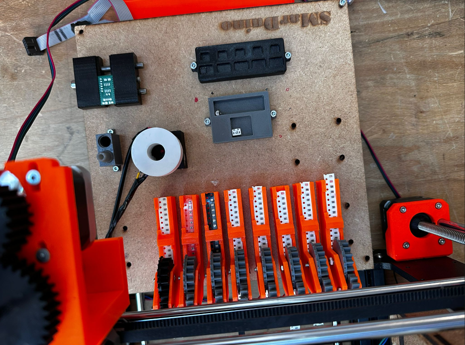
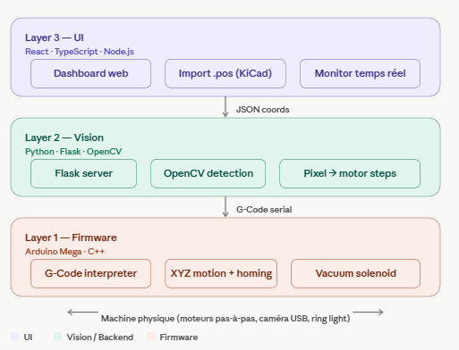
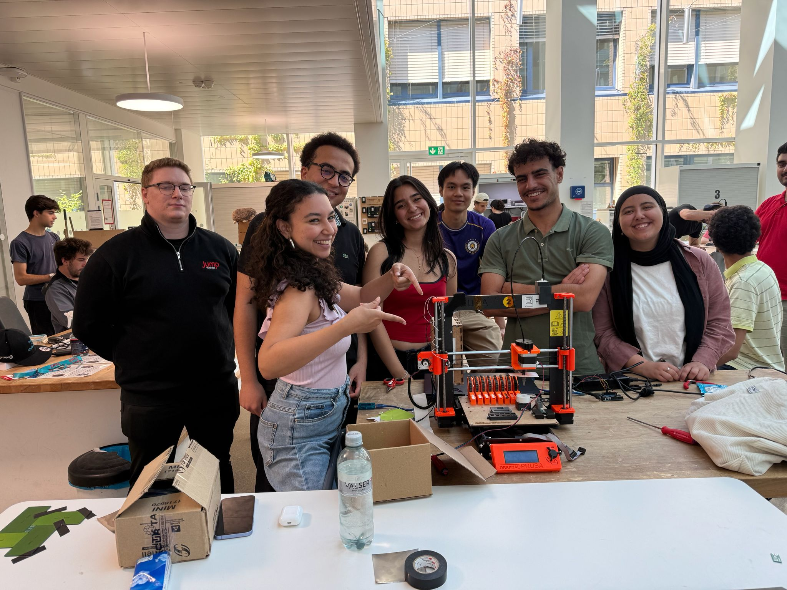

# SMarDuino : Pick and Place Machine
Assembling electronic boards manually is a slow and error-prone task. Professional **Pick and Place** machines are often expensive or limited in the thickness of components they can handle.

**SMarDuino** transforms a standard **Prusa i3 MK3S+ 3D printer** into a high-precision automated assembly station. By repurposing the printer's rigid frame and precise motion system, we create a machine capable of:
*   Picking different SMD components.
*   Correcting orientation via a **Bottom Camera (OpenCV)**.
*   Placing them accurately on a PCB using a vacuum-controlled nozzle.

## Table of contents
- [The final product](#the-final-product)
- [Bill of materials](#bill-of-materials)
- [Before you start](#before-you-start)
- [Build your machine](#build-your-machine)
    - [1. Nozzle holder](#1-nozzle-holder)
        - [1.1 X-carriage](#11-x-carriage)
        - [1.2 Nozzle tips](#12-nozzle-tips)
        - [1.3 Nozzle](#13-nozzle)
    - [2. Plate](#2-plate)
        - [2.1 The base plate](#21-the-base-plate)
        - [2.2 Feeders: tape](#22-feeders-tape)
        - [2.3 Feeders: individual pieces](#23-feeders-individual-pieces)
        - [2.4 Camera holder](#24-camera-holder)
        - [2.5 PCB holder](#25-pcb-holder)
        - [2.6 Tip holder](#26-tip-holder)
    - [3. On the printer body](#3-on-the-printer-body)
        - [3.1 Pump holder](#31-pump-holder)
        - [3.2 Limit switches](#32-limit-switches)
    - [4. Electronics box](#4-electronics-box)
- [Wire your machine](#wire-your-machine)
    - [1. Electronics and Power](#electronics-and-Power)
    - [2. Camera and computer vision](#camera-and-computer-vision)
---

### The final product
[![Demo GIF]
*Watch our full demo video here: [Project Video Link]*](https://github.com/user-attachments/assets/6840ac97-82fd-42fa-adcd-1b4209363f77)
## Demo video
[See the full demo for big and little components](https://github.com/orgs/epfl-cs358/projects/52/views/1?pane=issue&itemId=184742349&issue=epfl-cs358%7C2026sp-SMarDuino%7C44)


---

## Bill of materials
### ***Electronics***
*   **Arduino Mega 2560** Board (x1)
*   **Arduino Uno** (x1)
*   **CNC** Shield (x1)
*   Stepper motor **17HS4401** (x5)
*   **A4988** driver (x5)
*   **Air pump RF370** (x1)
*   Air pump tubes (interior diameter 2.5mm and 4mm) (x1)
*   **USB bottom camera** (x1)
*   **USB isolator** (x1)
*   Power supply **12V 10A** (x1)
*   DC Jack (x1)
*   One buck convertor (x1)
*   **8-LED WS2812B NeoPixel** ring light (x1)
*   Jumper wires 

### ***Mechanical parts***
*   **Prusa i3 MK3S+** 3D printer 
*   **MDF board**
*   M2.5 and M3 Screws and nuts
*   2m **Purecrea GT2 belt** (6mm) (x1)
*   Bearing (x1)
*   Bearing (x1)
*   Spring (x1)
*   Insert (x1)
*   Steel rod (x2)

### ***Have access to*** 
*   3D printer with **PETG filament** 
*   Laser cutting machine

---

## Before you start
Before assembling the new parts, you first need to remove some of the original ones from your 3D printer. Grab a screwdriver and remove:
* The heated bed
* The extruder
* If needed, the belts — replace them with new ones

## Build your machine

### 1. Nozzle holder



#### ***1.1 X-carriage***

This assembly replaces the extruder and integrates both the nozzle holder and the feeder-advance trigger. To build it, print the following parts:
* X-carriage
* Nozzle head

Once printed, route the short timing belt through the two X-carriage halves and fasten them together along with the nozzle head. You then need to install:
* The two bearings in their designated seats
* The stepper motor used for nozzle rotation

#### ***1.2 Nozzle tips***
There are currently two tip sizes:
* A small one for components such as resistors, LEDs, etc.
* A larger one for components such as ICs, timers, etc.

PETG is not suitable here — it lacks the dimensional accuracy needed for a 1 mm bore. We therefore printed the tips in resin.

#### ***1.3 Nozzle***
The nozzle is a tube that passes through the two bearings in the nozzle head. Its rotation is driven by the stepper motor through a gear pair. Print the following:
* The nozzle
* The gear

Mount the gear on the stepper-motor shaft, then slide the nozzle through the bearings so the two gears mesh.

### 2. Plate


#### ***2.1 The base plate***
This replaces the heated bed. It is laser-cut from 4 mm MDF. To stabilize it, first print the spacers that go underneath, then screw the whole assembly down.

#### ***2.2 Feeders: tape***
After evaluating several designs, we settled on a passive mechanical feeder actuated by the nozzle itself. This is a stable and reliable system that also reduces the electrical load and the number of cables routed across the plate.

To build one, print these three pieces:
* Bottom sprocket
* Top gear
* Feeder body

Fasten the bottom sprocket and top gear to the feeder body with screws and nuts, then screw the feeder onto the base plate.

**How it works.** The head moves to the feeder and the vacuum nozzle descends into one of the holes on the tape's carrier strip. A linear move along the tape's axis then pulls the strip forward by one pitch, advancing the next component into the pickup position.

#### ***2.3 Feeders: individual pieces***
For our demo, we hard-designed dedicated holders that fit specific components by geometry. We recommend you either do the same for the components in your own build or rely on additional tape feeders instead.

#### ***2.4 Camera holder***
A small 3D-printed enclosure that holds the bottom-vision camera together with a diffuser for the LED ring light. Print:
* Light diffuser
* Camera holder

Glue the diffuser to the camera box.

#### ***2.5 PCB holder***
Start by printing the two parts contained in the file `PCBHolder`.

The holder uses a spring-loaded clamping design. The assembly consists of two rods, a screw, a spring, and a threaded insert pressed into the moving jaw, which together allow controlled translation to clamp PCBs of different widths. (Refer to the image for details.)

#### ***2.6 Tip holder***

For now this part is only used to store the tips, but it is intended to become the docking station for an automatic tip-change routine.

### 3. On the printer body
#### ***3.1 Pump holder***
A simple bracket mounted on top of the printer frame. Print it and slide the vacuum pump into it.

#### ***3.2 Limit switches***
Limit switches serve three purposes:
* **Homing** — establishing the machine's zero reference at startup
* **Crash protection** — stopping a motor before the head reaches a mechanical end-stop
* **Workspace bounds** — defining the usable travel of each axis in software

We installed one switch per axis (X, Y, Z), three in total. Print the three switch brackets and make sure they are rigidly fixed — a large share of calibration accuracy issues trace back to a loose limit-switch mount.

### 4. Electronics box
To keep the wiring tidy and protected, we designed a laser-cut MDF enclosure. The bottom is left open for easy power-supply routing and Arduino access, and a sliding door provides quick access for last-minute adjustments. 

Once all the parts are cut, assemble them with wood glue. When the box has set, fasten it to the same side of the printer as the X-axis motor, then mount the control circuit on the right-hand inner wall and close the door.

---
## Wire your machine
### 1. Electronics and Power
To avoid electrical noise, we implemented a **Dual Power Supply** system:
1.  **PSU A (12V/10A)**: Dedicated to the 5 high-current stepper motors.
2.  **BUCK Convertor** : from 12V to 5V for the pump

The final electronic architecture of the project contains:

- Arduino Mega connected to the CNC Shield
- Five stepper motor drivers installed and configured
- X, Y, Z and rotation motors connected
- Limit switches added for homing
- Vacuum pump controlled using a transistor switching circuit
- The transistor allows the Arduino to safely activate and deactivate the pump
- Buck converter used to provide a stable power supply for the pump
- Camera system connected for component alignment
- Common ground shared between all electronic modules

This setup allows the machine to perform the full pick-and-place workflow:
homing, component pickup, camera alignment, and PCB placement.
**Circuit Schematic:**

(

### 2. Camera and computer vision
The bottom-vision camera looks **upward** at the nozzle so that, with a component held against the tip, the system can verify its orientation before placement and apply a rotation correction if needed.

The camera is paired with an **8-LED WS2812B NeoPixel ring** (32 mm outer / 18 mm inner diameter) that surrounds the lens. Ring illumination is essential here: it provides even, shadow-free lighting on the underside of the component, which is what the vision pipeline relies on to extract a clean silhouette and a stable orientation reading. The ring is driven from a single Arduino digital pin via the Adafruit NeoPixel library.

#### ***Wiring Diagram***
Based on the implementation, the connections are as follows:

| Ring Light Wire | Arduino Pin | Function |
| :--- | :--- | :--- |
| **Red** | **5V** | Power Supply (Stable 5V for LED consistency) |
| **Black** | **GND** | Ground |
| **Purple/blue** | **D10** | Signal / Control Pin 10 |
| **Yellow** | **D11** | Signal / Control Pin 11 |

---

## Running the software

### Software Layers
SMarDuino runs on a three-tier software architecture:

*   **Layer 1 (Firmware)**: Custom G-Code interpreter on Arduino Mega to handle XYZ movements and vacuum solenoid. [README of the WebApp](./3d-placer-monitor/README.md).
*   **Layer 2 (Vision)**: Python script using **OpenCV** to detect component contours, extract rotation angles, and send correction commands. [README of the computer vision](./computer_vision/README.md).
*   **Layer 3 (UI)**: A web dashboard to upload PCB design files (CSV) and monitor the placement progress in real-time.
*   
  

### Prerequisites
- **Node.js** ≥ 18 and **npm**
- **Python** ≥ 3.10 with `pip`
- **Arduino IDE** (or `arduino-cli`)
- A USB-A cable to the Arduino Mega

### 1. Flash the firmware
1. Open `3d-placer-monitor/placer_4axis/placer_4axis.ino` in the Arduino IDE.
2. Install the **AccelStepper** library via *Sketch → Include Library → Manage Libraries → search "AccelStepper" → Install*.
3. Select board: **Arduino Mega 2560**, select the right serial port, click **Upload**.
4. Open the Serial Monitor at **9600 baud** to confirm the `READY` banner appears, then close it (only one process can own the serial port at a time).

### 2. Start the web dashboard
```bash
cd 3d-placer-monitor
npm install
npm start
```
Open **http://localhost:3000** for the Monitor view, or **http://localhost:3000/placement.html** for the Placement view. Pick the Arduino's COM port from the dropdown and click **Connect**.

### 3. Run the bottom-vision module
```bash
cd computer_vision
python vision_bridge.py --camera 1 --port 5001 --pcb "C:path\to\your\pos\file.csv"
```
Open it on **http://localhost:3000/vision.html** 

Change the camera index if it is the wrong one


## Acknowledgments

### Contributers
*   [**Alae Messaoudi**](https://github.com/alaemessaoudi)
*   [**Khalil Romdhane**](https://github.com/khalilromdhane)
*   [**Yahya Boussaadia**](https://github.com/yahyaboussaadia)
*   [**Yosr Hallab**](https://github.com/yosrhallab)
*   [**Zeineb Sellami**](https://github.com/zeinebsellami) 

We would like to thank our professor and TAs for the guidance and the patience throughout the whole semester. Special thanks to the friends who showed up, stayed late, and cheered when a single resistance finally landed where it was supposed to.
And a moment of silence, for all the A4988 drivers who gave their lives so this project could move. Gone, but not forgotten. 

  
